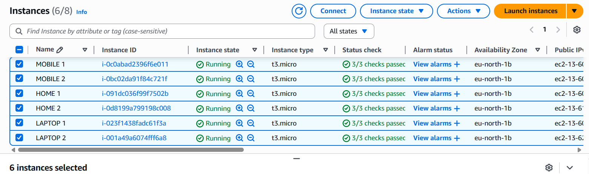
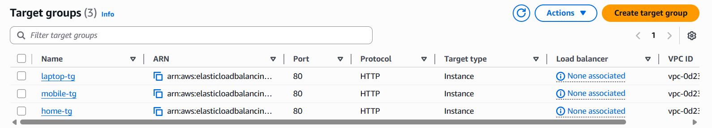
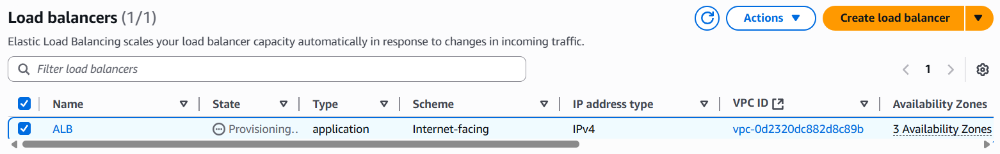
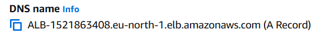

# AWS Application Load Balancer (Mini Project)

## Overview
This project walks through deploying an **Application Load Balancer (ALB)** in AWS to evenly distribute traffic across three EC2 instances.  
Each instance (named **Home**, **Laptop**, and **Mobile**) hosts a custom Apache web page. The ALB is then configured to route incoming requests and verify distribution by refreshing the DNS link.

---

## Architecture Summary
1. **EC2 Instances**
   - Launch **3 Amazon Linux t2.micro instances** (Free Tier).  
   - Use User Data scripts to install Apache (httpd) and serve unique pages.

2. **Target Groups**
   - Create three target groups (one per instance).  
   - Register each instance to its respective target group.

3. **Application Load Balancer**
   - Create an ALB and attach the target groups.  
   - Configure **HTTP:80 listener** to forward traffic.

---

## Implementation Steps

### Step 1: Launch EC2 Instances

For each instance, use a **User Data script** to install Apache and serve a custom page.

**Home Instance**
```bash
#!/bin/bash
yum update -y
yum install -y httpd
systemctl start httpd
systemctl enable httpd
echo "<h1> Welcome to the Home Page - $(hostname -f)</h1>" > /var/www/html/index.html
```

**Laptop Instance**
```bash
#!/bin/bash
yum update -y
yum install -y httpd
systemctl start httpd
systemctl enable httpd
mkdir /var/www/html/laptop
echo "<h1> Laptop Page - $(hostname -f)</h1>" > /var/www/html/laptop/index.html
```

**Mobile Instance**
```bash
#!/bin/bash
yum update -y
yum install -y httpd
systemctl start httpd
systemctl enable httpd
mkdir /var/www/html/mobile
echo "<h1> Mobile Page - $(hostname -f)</h1>" > /var/www/html/mobile/index.html
```

---

### Step 2: Configure Target Groups
- In the **AWS Console → Target Groups**, create 3 target groups.  
- Register each instance under its group (Home → TG-Home, Laptop → TG-Laptop, Mobile → TG-Mobile).  


---

### Step 3: Create Application Load Balancer
- Go to **EC2 → Load Balancers → Create ALB**.  
- Add the **three target groups**.  
- Configure **Listener on Port 80 (HTTP)** to forward requests to the groups.  

---

### Step 4: Test the Load Balancer
- Copy the **ALB DNS name** from the console.  
- Paste it into a browser and refresh multiple times.  
- You should alternately see:  
  - Home instance response  
  - Laptop instance response  
  - Mobile instance response  

---

## Expected Output
- **Home Page:** ` This is the Home Instance`  


- **Laptop Page:** ` This is the Laptop Instance` 


- **Mobile Page:** ` This is the Mobile Instance`


---

## Conclusion
We successfully set up an **Application Load Balancer** in AWS that distributes requests across three EC2 servers. Each instance serves a custom page, and the ALB ensures traffic is shared evenly, verifying the load balancing feature.

---
